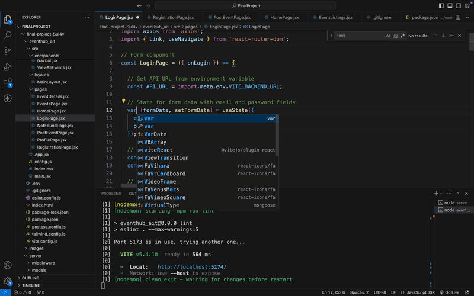

Milestone 04 - Final Project Documentation
===

NetID
---
sgs9904

Name
---
Sulav G. Shrestha

Repository Link
---
https://github.com/nyu-csci-ua-0467-001-002-fall-2024/final-project-Sul4v.git

URL for deployed site 
---
http://linserv1.cims.nyu.edu:12208

URL for form 1 (from previous milestone) 
---
This is the Form link:
http://linserv1.cims.nyu.edu:12208/post-event

This is where the results are reflected:
http://linserv1.cims.nyu.edu:12208/events

Special Instructions for Form 1
---
To post an event, you have to log in. Register a user and then log in.

URL for form 2 (for current milestone)
---
http://linserv1.cims.nyu.edu:12208/login

Special Instructions for Form 2
---
Register a user from the registration page to log in.

URL for form 3 (from previous milestone) 
---
http://localhost:5174/registration

Special Instructions for Form 3
---
Easy to register a user. 

First link to github line number(s) for constructor, HOF, etc.
---
[map](https://github.com/nyu-csci-ua-0467-001-002-fall-2024/final-project-Sul4v/blob/5f6b57e59e9997f4c782a59520064f8a2dcb3974/eventhub_ait/src/components/EventListings.jsx#L16)

Second link to github line number(s) for constructor, HOF, etc.
---
[filter](https://github.com/nyu-csci-ua-0467-001-002-fall-2024/final-project-Sul4v/blob/5f6b57e59e9997f4c782a59520064f8a2dcb3974/server/server.mjs#L228) 

Short description for links above
---
For the first one, I've used map to display same component for different array elements. 

For the second one, I've used the "filter" function to filter one user/participant from a list of users/participants.

Link to github line number(s) for schemas (db.js or models folder)
---
[db.js](https://github.com/nyu-csci-ua-0467-001-002-fall-2024/final-project-Sul4v/blob/5f6b57e59e9997f4c782a59520064f8a2dcb3974/server/db.mjs)

Description of research topics above with points
---

3 points - applied auto Eslint with Vite
2 points - used TailWindCSS
6 points - used ReactJS for the whole front-end

Links to github line number(s) for research topics described above (one link per line)
---
[Eslint](https://github.com/nyu-csci-ua-0467-001-002-fall-2024/final-project-Sul4v/blob/5f6b57e59e9997f4c782a59520064f8a2dcb3974/eventhub_ait/eslint.config.js)

[One example of TailWindCSS](https://github.com/nyu-csci-ua-0467-001-002-fall-2024/final-project-Sul4v/blob/5f6b57e59e9997f4c782a59520064f8a2dcb3974/eventhub_ait/src/pages/LoginPage.jsx#L86)

[ReactJS](https://github.com/nyu-csci-ua-0467-001-002-fall-2024/final-project-Sul4v/blob/5f6b57e59e9997f4c782a59520064f8a2dcb3974/eventhub_ait/src/App.jsx)

Optional project notes 
--- 
Gif of running eslint:

Attributions
---