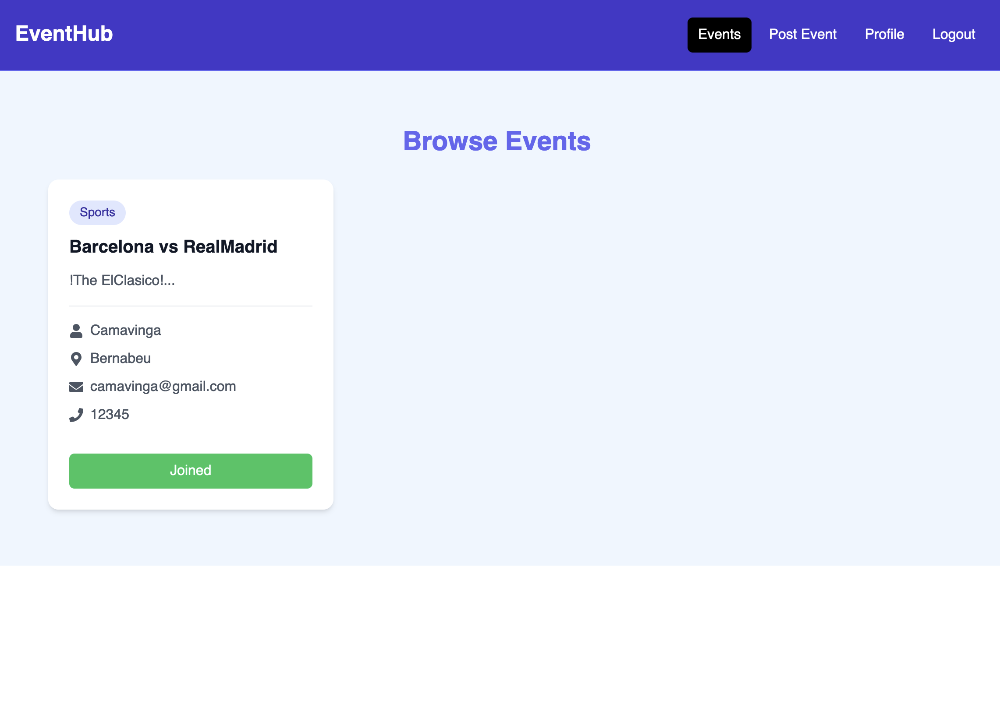
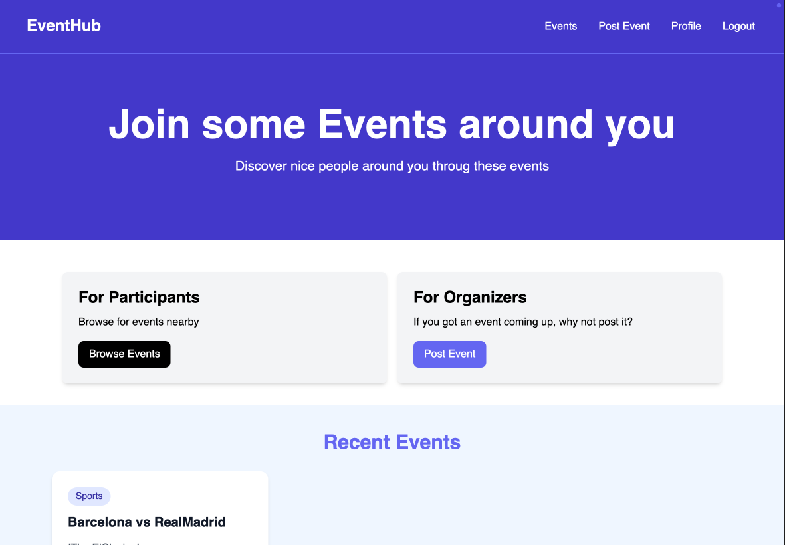
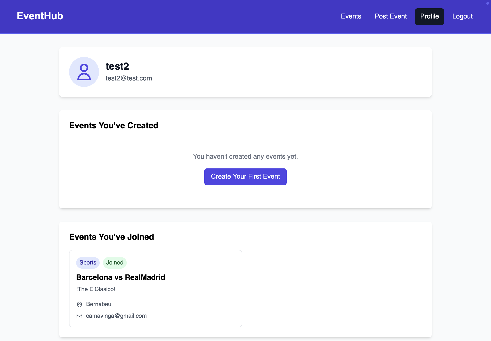
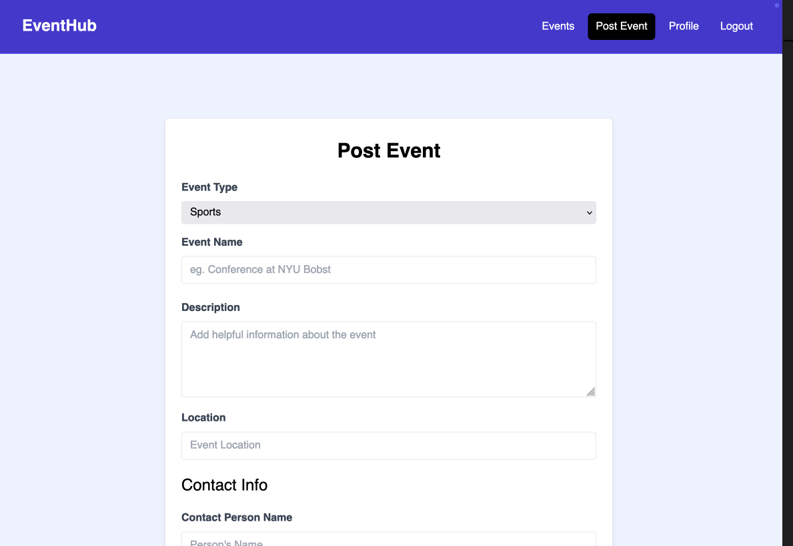
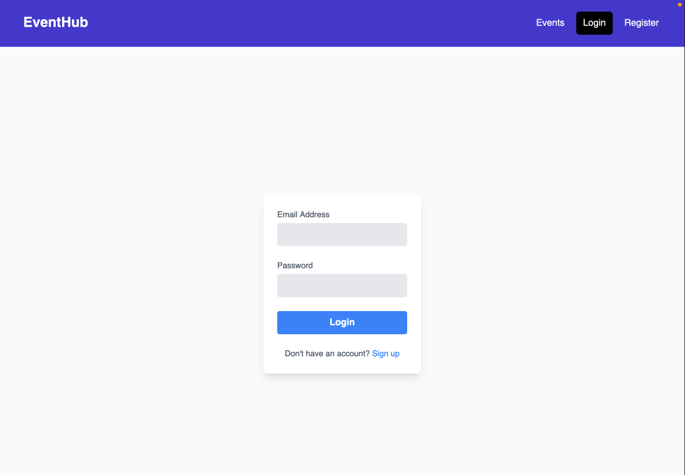
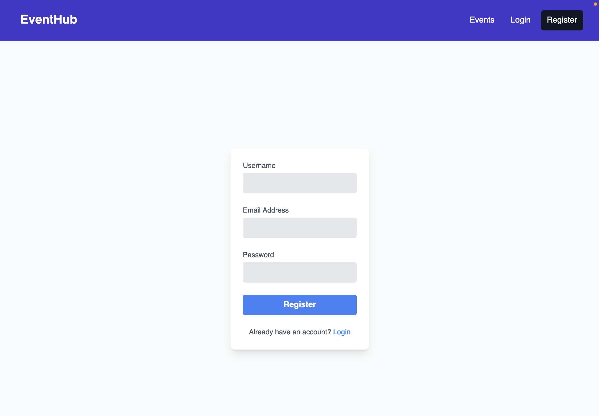
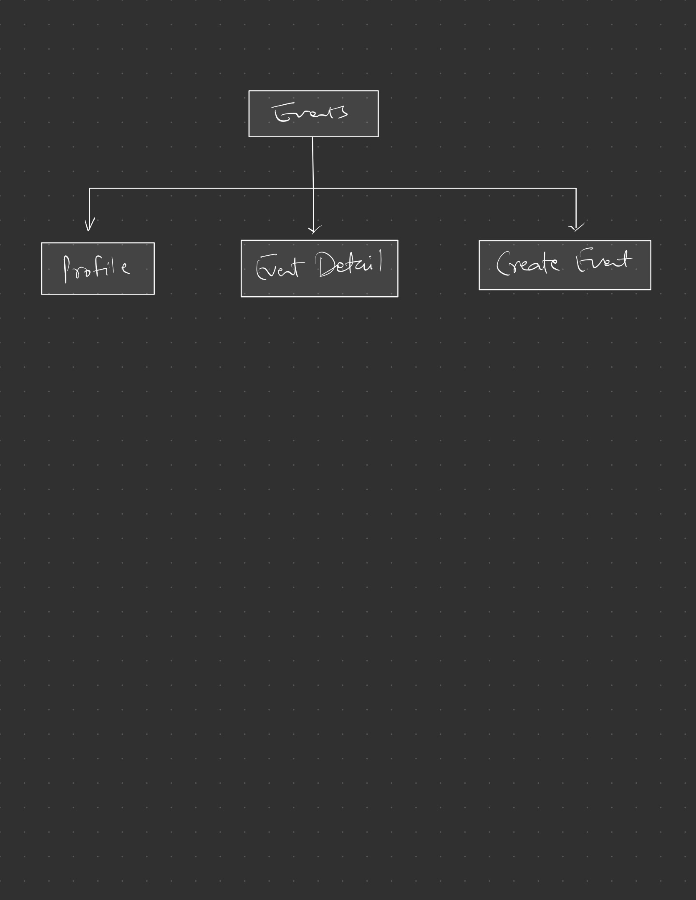

# EventHub

## Overview

EventHub is a web application that allows individuals, organizations, and businesses to post and manage events. Users can browse various events, join those they’re interested in, and view their upcoming events on their profiles. Whether it's a concert, workshop, community meet-up, or corporate seminar, EventHub makes it easy to discover and participate in events of all kinds.

Registered users can log in to create, view, and join events. The platform provides a user-friendly interface for event organizers to promote their events and for users to keep track of the ones they've joined.


## Data Model

The application will store the following entities: Users, Events, and Join Records, and it will have relationships between them as follows:

* Users can create and join multiple events.
* Events can have multiple participants (Users).

An Example User:

```javascript
{
  username: "janedoe",
  email: "janedoe@gmail.com",
  password: // a password hash,
  createdEvents: // an array of references to Event documents,
  joinedEvents: // an array of references to Join Record documents
}
```

An Example Event:

```javascript
{
  type: "Conference"
  name: "Tech Conference 2024",
  description: "A two-day event covering the latest in tech.",
  location: "New York City, NY",
  contactName: // Organizer's name,
  contactEmail: // Organizer's email,
  contactPhone: // Organizer's phone,
  createdBy: // UserSchema of the creator
  participants: // Array of joined UserSchema
}
```

## [Link to Commented First Draft Schema](src/db.mjs) 


## Wireframes

/ - Homepage

/events - page for viewing all available events

/post-event - page for posting a new event

/event/:id
- page for viewing details of a specific event

/profile - user profile page showing user profile and joined events or created events









## Site map 



* Home (/)
  - Landing page introcuing the app, with links to login or sign up

* Sign Up (/registration)
  - Page for new users to register
  - Links to login page if the user already has an account

* Login (/login)
  - Page for existing users to log in
  - Links to sign-up page if the user doesn't have an account

* Events (/events)
  - Main user page after login
  - Shows a feed of all upcoming events with options to view details or join.
  - Sub-pages from Dashboard
    
    + Event Details (/events/:id)
      - Page displaying specific event details
      - Option to join the event if not already joined

* Post Event (/post-event)
  - Form for users to post a new event

* Profile (/profile)
  - Shows the user's joined events and created events


### Site Map Flow Example

  * Sign Up (/signup)
      ↓ After sign-up, redirects to Home Page
  * Login (/login)
      ↓ After login, redirects to Home Page
  * Home (/)
      ↓ Links to Events, Post Event, or Profile pages
  * Events (/events)
      ↓ Access all events
      ↓ Links to Create Event and Event Details pages
  * Event Details (/events/:id)
      - Join event option
  * Profile (/profile)
      ↓ Shows joined events and created events

## User Stories or Use Cases

1. as non-registered user, I can register a new account with the site
2. as a user, I can log in to the site
3. as a user, I can create a new event
4. as a user, I can view a list of all events
5. as a user, I can join events
6. as a user, I can view the events I have joined or created on my profile page

## Research Topics

* (3 points) Vite with EsLint

* (2 points) TailwindCSS
    * will use TailwindCSS to design the pages in the webapp
* (6 points) react.js
    * will use react.js as the frontend framework; it's a challenging library to learn, so I've assigned it 6 points


## [Link to Initial Main Project File](eventhub_ait/src/App.jsx)  

## Annotations / References Used

Nothing as of yet